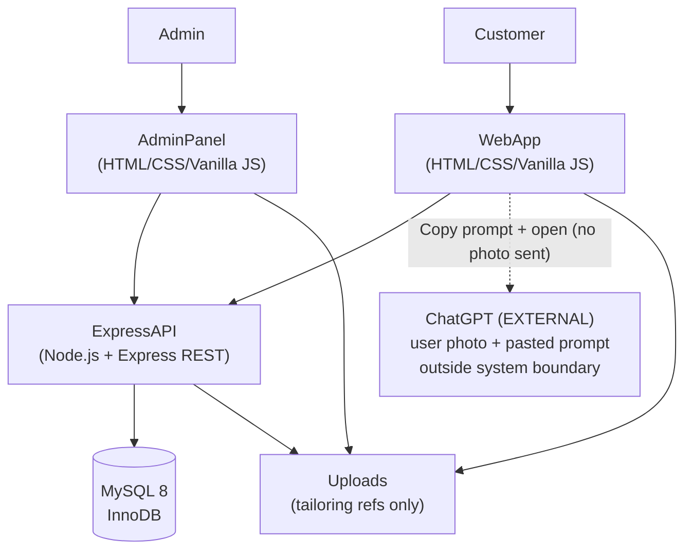
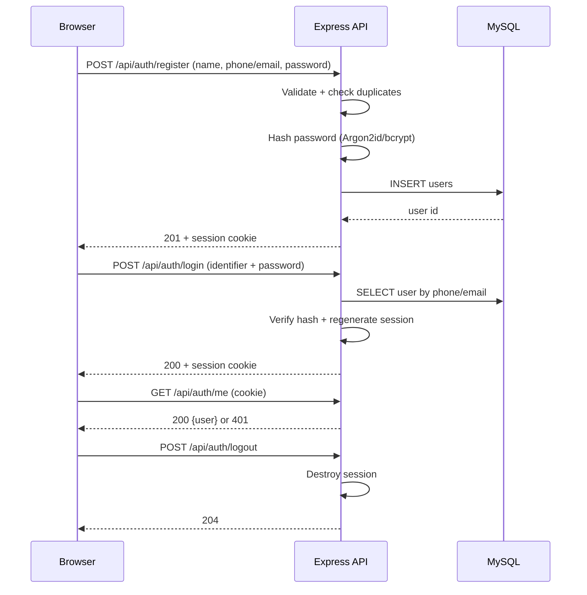
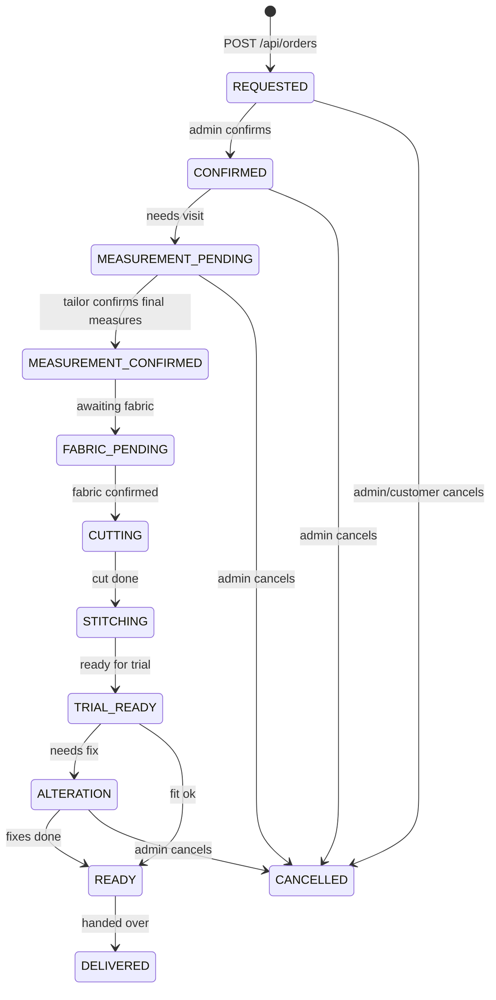
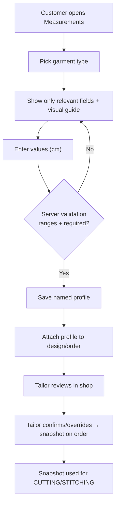
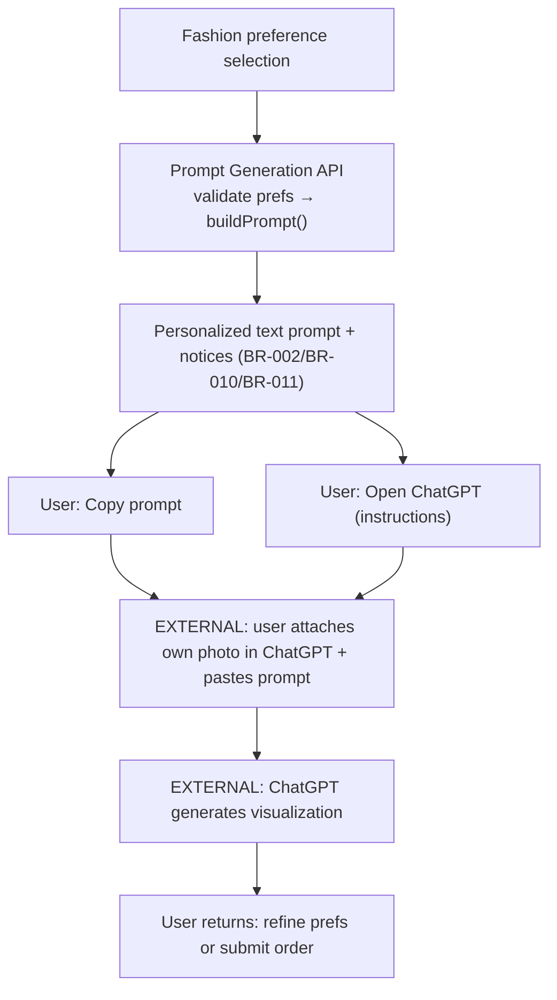
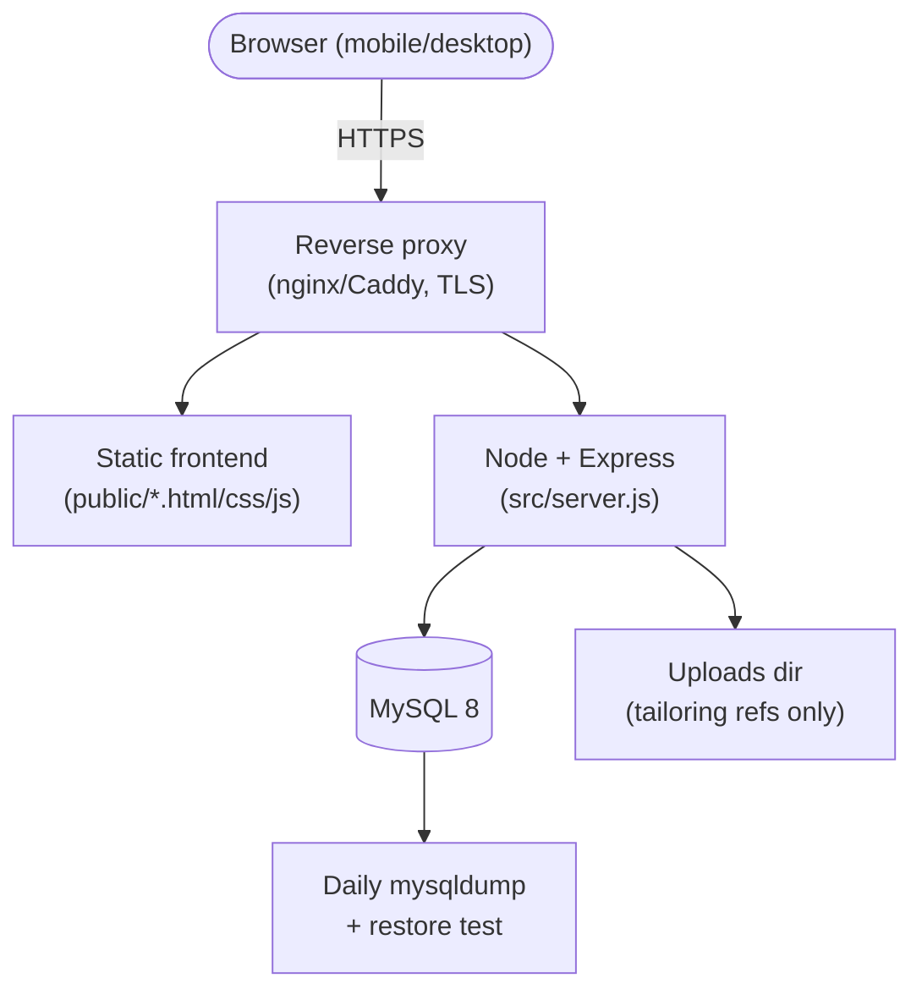

# Digital Tailor — Architecture (ARCHITECTURE)

> `PLANNED ARCHITECTURE` — nothing below is implemented.
> `CURRENT STATUS: NOT IMPLEMENTED` for app, API, DB, auth, measurement, orders, prompt generation.
> Stack: HTML/CSS/Vanilla JS → Express REST → MySQL; ChatGPT via user-driven prompt workflow (external).
>
> **Boundary (2026-09-11):** Digital Tailor generates **text prompts only**. No built-in image generation,
> virtual try-on, image APIs, GPU infrastructure, or generated-image storage exists or is planned.

- Related: PRD.md, TECH_SPEC.md, DATABASE.md, API_SPEC.md, UI_SPEC.md, SECURITY.md

---

## 0. Principles

1. Boring technology, small surface area (single deployable backend + static frontend + one MySQL). No image pipeline.
2. Server is authoritative (price, offer, ownership, status, prompt validation). Browser never touches MySQL.
3. Tailor-confirmed measurement is authoritative for stitching (BR-001).
4. Prompts are decision-support text, not a guarantee (BR-002, BR-010). Digital Tailor never renders images.
5. Privacy by minimization: visualization photos never enter Digital Tailor (BR-011).
6. Everything auditable: status history + admin actions.

---

## 1. High-Level Architecture (PLANNED)



**Reads:** Customer/Admin → static pages → `fetch(/api/…)` → Express services → parameterized SQL → MySQL.
**Writes:** same path, with validation + RBAC + transactions.
**AI path (text only):** browser and/or API builds the text prompt; user copies it and opens ChatGPT manually. **No photo, no image bytes, and no inference cross the Digital Tailor boundary.** ChatGPT is an external service Digital Tailor does not control.

---

## 2. Customer Journey (PLANNED)


States H–K map to the order lifecycle (§4). The ChatGPT visualization itself happens outside this journey, in the user's own ChatGPT session.

---

## 3. Authentication Flow (PLANNED)



Notes: session in httpOnly `Secure; SameSite=Lax` cookie; CSRF token for mutations (see SECURITY.md). Rate-limit login/register **and prompt endpoints**. Roles (`customer/admin`) checked server-side on every request.

---

## 4. Order Lifecycle (PLANNED / RECOMMENDED statuses)



Rules: only `admin` advances stitching states (BR-006); every transition appends `order_status_history`; `DELIVERED`/`CANCELLED` terminal (BR-009). Customer sees own orders only (BR-005).

---

## 5. Measurement Workflow (PLANNED)



`measurement_profiles` (reusable) → `measurement_values` (key/value) → `order_measurements` (frozen snapshot at confirmation). Customer values are drafts; tailor snapshot is authoritative (BR-001).

---

## 6. AI Prompt Workflow — official (PLANNED, text only)

```text
User
  ↓
Digital Tailor Web App
  ↓
Fashion Preference Selection
  ↓
Prompt Generation API
  ↓
AI Prompt Generator
  ↓
Personalized Text Prompt
  ↓
Copy Prompt
  ↓
User opens ChatGPT
  ↓
User attaches their own photo
  ↓
User pastes Digital Tailor prompt
  ↓
ChatGPT generates visualization
```



Clearly: the ChatGPT visualization step is an **external service outside Digital Tailor's system boundary**. Digital Tailor does not control or process the generated image, receives no photo, stores no image, and runs no inference. No API keys in frontend; prompt-injection defenses + rate limits on the prompt API (see SECURITY.md, TECH_SPEC.md §14).

---

## 7. Deployment Architecture (PLANNED, single-node, lightweight)



- One VPS is enough for MVP; static + API behind same origin (no CORS pain).
- `NODE_ENV=production`, secure cookies, restricted `CORS_ORIGIN`, rate limits, JSON logs, uptime check.
- **Removed from requirements (2026-09-11):** GPU infrastructure, image-generation servers/workers, model hosting for image generation, large image models, image-generation queues, image-generation storage, CDN specifically for generated images.
- No Redis/Kafka/K8s/microservices in v1.

---

## 8. Module Map (RECOMMENDED backend)

```text
routes/ → controllers/ → services/ → db/queries → MySQL
```

| Concern | Module (PLANNED) |
|---|---|
| Auth | `routes/auth.routes.js`, `services/auth.service.js`, `utils/passwords.js`, `middleware/auth.js` |
| Catalog | `routes/garments.routes.js`, `services/catalog.service.js` |
| Designs + preferences | `routes/designs.routes.js`, `services/designs.service.js` |
| Prompt generation | `routes/prompts.routes.js`, `services/prompts.service.js`, `utils/promptBuilder.js` (shared logic; mirrored in `public/js/prompt.js`) + tests — **text only** |
| Measurements | `routes/measurements.routes.js`, `services/measurements.service.js` |
| Orders | `routes/orders.routes.js`, `services/orders.service.js` (transactions + state machine) |
| Offers | `routes/offers.routes.js`, `services/offers.service.js` (eligibility) |
| Appointments | `routes/appointments.routes.js`, `services/appointments.service.js` |
| Uploads (tailoring refs) | `middleware/upload.js`, `services/uploads.service.js` |

Frontend modules: `public/js/api.js`, `auth.js`, `prompt.js`, page scripts per UI_SPEC.md route (incl. Prompt Studio).

**Forbidden modules (do not create):** image-generation service, virtual try-on service, inference worker/queue, generated-image gallery/storage.

---

*End of ARCHITECTURE. All diagrams are PLANNED; verify Mermaid renders before implementation (see TASKS.md Phase 1). Text-prompt boundary (2026-09-11) applies.*
