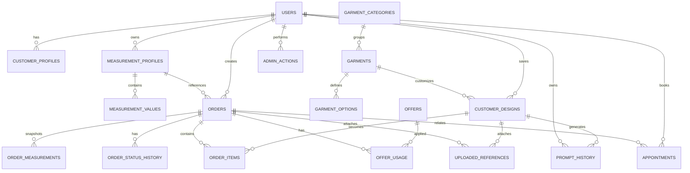

# Digital Tailor — Database Design (DATABASE)

> `CURRENT DATABASE: NOT IMPLEMENTED`
> No MySQL server, schema, migration, or seed data exists yet.
> Below is the `RECOMMENDED DATABASE DESIGN` for future implementation (MySQL 8, InnoDB, `utf8mb4_unicode_ci`).
>
> **Boundary (2026-09-11):** No entities for generated fashion images, image-generation jobs/status,
> generated image URLs, or image-model metadata. Prompt history is **text-based only**.
> `uploaded_references` stores **tailoring references (fabric/design) only** — never visualization photos.

- Related: PRD.md (§8–10), TECH_SPEC.md (§5), API_SPEC.md, SECURITY.md, TEST_PLAN.md

---

## 1. Conventions

- Engine `InnoDB`; charset `utf8mb4`.
- PKs: `BIGINT UNSIGNED AUTO_INCREMENT` named `id`, except join/value tables where composite PK is noted.
- FKs: `BIGINT UNSIGNED`, indexed; `ON DELETE RESTRICT` for catalog/orders; `CASCADE` only for owned children (`measurement_values`, `order_items` on order delete in dev only — prod prefers RESTRICT + soft cancel; `prompt_history` per policy below).
- Money: `DECIMAL(10,2)` in INR (or store paise as INT — pick one before Phase 2; this doc uses DECIMAL).
- Dates: `TIMESTAMP NULL` for optional, `TIMESTAMP NOT NULL DEFAULT CURRENT_TIMESTAMP` for `created_at`; `DATETIME` for business times (`scheduled_at`, `starts_at/ends_at`).
- Status/role/option fields: `VARCHAR` with `CHECK` constraint listing allowed values (MySQL 8.0.16+ enforces CHECK) + app-level enum mirror.
- Soft delete: catalog uses `is_active TINYINT(1)`; users use `is_active`; orders/appointments use status, never hard-deleted in prod.
- Every table: `created_at`, `updated_at` (`ON UPDATE CURRENT_TIMESTAMP`).

---

## 2. ER Overview (RECOMMENDED)

> No `generated_images`, `image_jobs`, `image_urls`, or model-metadata entities exist by design.

---

## 3. Tables

### 3.1 `users` — login + role

**Why:** single identity for customers and admins; RBAC enforced off `role`.

| Column | Type | Null | Default | Notes |
|---|---|---|---|---|
| `id` | BIGINT UNSIGNED AI | NO | — | PK |
| `name` | VARCHAR(100) | NO | — | Display name |
| `phone` | VARCHAR(20) | NO | — | Unique; normalized E.164-ish |
| `email` | VARCHAR(191) | YES | NULL | Unique when present |
| `password_hash` | VARCHAR(255) | NO | — | Argon2id/bcrypt string; NEVER plaintext |
| `role` | VARCHAR(20) | NO | `'customer'` | CHECK IN ('customer','admin') |
| `is_active` | TINYINT(1) | NO | 1 | Deactivate instead of delete |
| `created_at` / `updated_at` | TIMESTAMP | NO | CURRENT_TIMESTAMP |  |

- PK: `id`. UNIQUE: `phone`, `email`. INDEX: `role, is_active`.
- CHECK: `role IN ('customer','admin')`.

### 3.2 `customer_profiles` — reusable contact info (1:1 with customer users)

**Why:** separates auth (`users`) from business profile (address, preferences) so admin/staff edits don't touch credentials.

| Column | Type | Null | Default | Notes |
|---|---|---|---|---|
| `id` | BIGINT UNSIGNED AI | NO | — | PK |
| `user_id` | BIGINT UNSIGNED | NO | — | FK → users.id, UNIQUE |
| `address` | VARCHAR(500) | YES | NULL |  |
| `city` | VARCHAR(100) | YES | NULL |  |
| `notes` | VARCHAR(500) | YES | NULL | e.g. "prefers evening slots" |
| `created_at` / `updated_at` | TIMESTAMP | NO | … |  |

- FK: `user_id → users.id ON DELETE CASCADE`. UNIQUE: `user_id`.

### 3.3 `measurement_profiles` — named reusable sets (FR-005)

**Why:** customer owns multiple profiles ("Standard", "Festive fitting"); orders reference one + freeze a snapshot.

| Column | Type | Null | Default | Notes |
|---|---|---|---|---|
| `id` | BIGINT UNSIGNED AI | NO | — | PK |
| `customer_id` | BIGINT UNSIGNED | NO | — | FK → users.id |
| `name` | VARCHAR(100) | NO | — | e.g. "My standard" |
| `garment_hint` | VARCHAR(50) | YES | NULL | e.g. 'kurti','pant' (UI hint, not enforced) |
| `is_default` | TINYINT(1) | NO | 0 | One default per customer (app-enforced) |
| `created_at` / `updated_at` | TIMESTAMP | NO | … |  |

- INDEX: `customer_id`. (App ensures only one `is_default=1` per customer via transaction.)

### 3.4 `measurement_values` — key/value rows per profile

**Why:** garments need different fields (PRD §8.2); EAV-per-profile avoids 16 nullable columns and sparse rows, while `order_measurements` freezes what was actually used.

| Column | Type | Null | Default | Notes |
|---|---|---|---|---|
| `profile_id` | BIGINT UNSIGNED | NO | — | FK → measurement_profiles.id ON DELETE CASCADE (PK part) |
| `field_key` | VARCHAR(40) | NO | — | PK part; CHECK IN (bust,waist,hip,shoulder,armhole,sleeve_length,kurti_length,dress_length,neck_width,front_neck_depth,back_neck_depth,pant_length,palazzo_length,inseam,thigh,bottom_width) |
| `value_cm` | DECIMAL(5,1) | NO | — | CHECK 2.0–250.0 (app enforces tighter per-field ranges) |

- PK: (`profile_id`, `field_key`). FK cascade delete with profile.

### 3.5 `garment_categories` — Salwar Suit, Kurti, etc.

| Column | Type | Null | Default | Notes |
|---|---|---|---|---|
| `id` | BIGINT UNSIGNED AI | NO | — | PK |
| `slug` | VARCHAR(50) | NO | — | UNIQUE, e.g. 'kurti','palazzo','one-piece' |
| `name` | VARCHAR(100) | NO | — | Display |
| `description` | VARCHAR(500) | YES | NULL |  |
| `is_active` | TINYINT(1) | NO | 1 |  |
| `sort_order` | INT | NO | 0 |  |
| `created_at` / `updated_at` | TIMESTAMP | NO | … |  |

### 3.6 `garments` — catalog items with base price + catalog image

| Column | Type | Null | Default | Notes |
|---|---|---|---|---|
| `id` | BIGINT UNSIGNED AI | NO | — | PK |
| `category_id` | BIGINT UNSIGNED | NO | — | FK → garment_categories.id RESTRICT |
| `name` | VARCHAR(150) | NO | — | e.g. "Straight-fit Cotton Kurti" |
| `description` | VARCHAR(1000) | YES | NULL |  |
| `base_price` | DECIMAL(10,2) | NO | — | CHECK ≥ 0 |
| `image_path` | VARCHAR(500) | YES | NULL | Catalog asset path (catalog photography, not AI-generated) |
| `is_active` | TINYINT(1) | NO | 1 |  |
| `created_at` / `updated_at` | TIMESTAMP | NO | … |  |

- INDEX: `category_id, is_active`.

### 3.7 `garment_options` — allowed customization + style values per garment

**Why:** admin defines which necks/sleeves/fits/fabrics/styles apply; preference form + customizer render only these (prevents invalid combos; feeds prompt builder).

| Column | Type | Null | Default | Notes |
|---|---|---|---|---|
| `id` | BIGINT UNSIGNED AI | NO | — | PK |
| `garment_id` | BIGINT UNSIGNED | NO | — | FK → garments.id CASCADE |
| `option_type` | VARCHAR(40) | NO | — | CHECK IN ('fabric','color','neck','sleeve','length','fit','embroidery','occasion','style','footwear','accessory','hairstyle','background','lighting') |
| `option_value` | VARCHAR(100) | NO | — | e.g. 'round','3-4-sleeve','straight-fit','festive','block-heels' |
| `price_delta` | DECIMAL(10,2) | NO | 0.00 | Extra charge for tailoring options (0 for pure styling hints) |
| `is_active` | TINYINT(1) | NO | 1 |  |

- UNIQUE: (`garment_id`, `option_type`, `option_value`).

### 3.8 `customer_designs` — saved customization + fashion preferences (FR-013/FR-004)

**Why:** the digital version of "what we discussed" plus styling preferences; reusable for reorder + prompt generation + order. `ai_prompt` caches the last generated **text** prompt.

| Column | Type | Null | Default | Notes |
|---|---|---|---|---|
| `id` | BIGINT UNSIGNED AI | NO | — | PK |
| `customer_id` | BIGINT UNSIGNED | NO | — | FK → users.id |
| `garment_id` | BIGINT UNSIGNED | NO | — | FK → garments.id RESTRICT |
| `title` | VARCHAR(150) | NO | — | e.g. "Dark green festive kurti" |
| `fabric_source` | VARCHAR(20) | NO | — | CHECK IN ('own','shop') |
| `fabric_detail` | VARCHAR(300) | YES | NULL | e.g. "cotton, dark green, own cloth" |
| `color` | VARCHAR(50) | YES | NULL |  |
| `neck` | VARCHAR(50) | YES | NULL |  |
| `sleeve` | VARCHAR(50) | YES | NULL |  |
| `length_opt` | VARCHAR(50) | YES | NULL |  |
| `fit` | VARCHAR(50) | YES | NULL |  |
| `embroidery` | VARCHAR(300) | YES | NULL |  |
| `occasion` | VARCHAR(80) | YES | NULL | e.g. 'festive','wedding','office','casual' |
| `style` | VARCHAR(80) | YES | NULL | e.g. 'modest','modern','traditional' |
| `footwear` | VARCHAR(150) | YES | NULL | e.g. 'nude block heels' |
| `accessories` | VARCHAR(300) | YES | NULL | e.g. 'gold jhumkas, clutch' |
| `hairstyle` | VARCHAR(150) | YES | NULL | e.g. 'low bun' |
| `grooming` | VARCHAR(150) | YES | NULL | Short grooming note |
| `season` | VARCHAR(40) | YES | NULL | e.g. 'summer','festive-season' |
| `location_context` | VARCHAR(150) | YES | NULL | e.g. 'indoor festive, warm tones' |
| `background` | VARCHAR(150) | YES | NULL | Prompt background hint |
| `lighting` | VARCHAR(100) | YES | NULL | e.g. 'soft natural light' |
| `extra_preferences` | VARCHAR(500) | YES | NULL | Additional user prefs (capped; injection-screened) |
| `custom_notes` | TEXT | YES | NULL | Verbatim customer text (escaped on render) |
| `ai_prompt` | TEXT | YES | NULL | Last generated **text** prompt (cached) |
| `created_at` / `updated_at` | TIMESTAMP | NO | … |  |

- INDEX: `customer_id, updated_at`.

### 3.9 `prompt_history` — text-based prompt history (FR-027, text only)

**Why:** lets users revisit/regenerate past prompts without storing any image. Each row is the frozen input snapshot + resulting text prompt.

| Column | Type | Notes |
|---|---|---|
| `id` PK (BIGINT UNSIGNED AI) |  |  |
| `user_id` FK → users.id CASCADE, INDEX (user_id, created_at) |  |  |
| `design_id` FK → customer_designs.id SET NULL NULL (NULL allowed for standalone styling prompts) |  |  |
| `inputs_snapshot` JSON NOT NULL (frozen preferences used) |  |  |
| `prompt_text` TEXT NOT NULL (final user-ready prompt) |  |  |
| `created_at` TIMESTAMP DEFAULT CURRENT_TIMESTAMP | No image URL, no binary, no model metadata |  |

### 3.10 `orders` — order/request header

| Column | Type | Null | Default | Notes |
|---|---|---|---|---|
| `id` | BIGINT UNSIGNED AI | NO | — | PK |
| `customer_id` | BIGINT UNSIGNED | NO | — | FK → users.id |
| `measurement_profile_id` | BIGINT UNSIGNED | YES | NULL | FK → measurement_profiles.id (nullable after delete; snapshot in order_measurements remains) |
| `status` | VARCHAR(30) | NO | `'REQUESTED'` | CHECK IN (REQUESTED,CONFIRMED,MEASUREMENT_PENDING,MEASUREMENT_CONFIRMED,FABRIC_PENDING,CUTTING,STITCHING,TRIAL_READY,ALTERATION,READY,DELIVERED,CANCELLED) |
| `subtotal` | DECIMAL(10,2) | NO | 0.00 | Computed server-side |
| `discount` | DECIMAL(10,2) | NO | 0.00 | From applied offer |
| `total` | DECIMAL(10,2) | NO | 0.00 | subtotal − discount |
| `notes` | TEXT | YES | NULL |  |
| `created_at` / `updated_at` | TIMESTAMP | NO | … |  |

- INDEX: `customer_id, status`, `status, created_at`.

### 3.11 `order_items` — one row per design in order (usually 1; supports sets)

| Column | Type | Null | Default | Notes |
|---|---|---|---|---|
| `id` | BIGINT UNSIGNED AI | NO | — | PK |
| `order_id` | BIGINT UNSIGNED | NO | — | FK → orders.id CASCADE |
| `design_id` | BIGINT UNSIGNED | YES | NULL | FK → customer_designs.id RESTRICT (NULL if ad-hoc) |
| `garment_id` | BIGINT UNSIGNED | NO | — | FK → garments.id RESTRICT (denormalized for history) |
| `qty` | INT | NO | 1 | CHECK ≥ 1 |
| `unit_price` | DECIMAL(10,2) | NO | — | Server-computed (base + deltas) |
| `options_snapshot` | JSON | YES | NULL | Frozen prefs/options at order time |

### 3.12 `order_measurements` — tailor-confirmed frozen snapshot (BR-001)

| Column | Type | Null | Default | Notes |
|---|---|---|---|---|
| `order_id` | BIGINT UNSIGNED | NO | — | FK → orders.id CASCADE (PK part) |
| `field_key` | VARCHAR(40) | NO | — | PK part (same CHECK as §3.4) |
| `value_cm` | DECIMAL(5,1) | NO | — | Confirmed value |
| `source` | VARCHAR(20) | NO | `'customer'` | CHECK IN ('customer','tailor'); tailor rows override |

- Written at order creation from profile (source='customer'), overwritten/confirmed by admin (source='tailor') before CUTTING.

### 3.13 `appointments`

| Column | Type | Null | Default | Notes |
|---|---|---|---|---|
| `id` | BIGINT UNSIGNED AI | NO | — | PK |
| `customer_id` | BIGINT UNSIGNED | NO | — | FK → users.id |
| `order_id` | BIGINT UNSIGNED | YES | NULL | FK → orders.id (optional link) |
| `reason` | VARCHAR(40) | NO | — | CHECK IN ('measurement','fabric-drop','design-discussion','trial','delivery','other') |
| `scheduled_at` | DATETIME | NO | — | Must be future on create |
| `status` | VARCHAR(20) | NO | `'REQUESTED'` | CHECK IN ('REQUESTED','CONFIRMED','COMPLETED','CANCELLED') |
| `notes` | VARCHAR(500) | YES | NULL |  |
| `created_at` / `updated_at` | TIMESTAMP | NO | … |  |

- INDEX: `scheduled_at, status`, `customer_id`.

### 3.14 `offers` + 3.15 `offer_usage`

**`offers`** — admin-controlled promos (no automated mood logic).

| Column | Type | Null | Default |
|---|---|---|---|
| `id` | BIGINT UNSIGNED AI PK |  |  |
| `title` VARCHAR(150) NOT NULL |  |  |  |
| `description` VARCHAR(1000) NULL |  |  |  |
| `discount_type` VARCHAR(20) NOT NULL CHECK IN ('percent','flat') |  |  |  |
| `discount_value` DECIMAL(10,2) NOT NULL CHECK ≥ 0 |  |  |  |
| `min_order` DECIMAL(10,2) NOT NULL DEFAULT 0.00 |  |  |  |
| `scope_category_id` BIGINT NULL FK → garment_categories (NULL = all) |  |  |  |
| `first_order_only` TINYINT(1) DEFAULT 0 |  |  |  |
| `starts_at` DATETIME NULL, `ends_at` DATETIME NULL |  |  |  |
| `is_active` TINYINT(1) DEFAULT 1 |  |  |  |
| `usage_limit` INT NULL (NULL = unlimited) |  |  |  |
| `created_by` BIGINT FK → users.id (admin) |  |  |  |

INDEX: `is_active, ends_at`.

**`offer_usage`** — one row per order that consumed an offer (eligibility re-checked server-side).

| Column | Type | Notes |
|---|---|---|
| `id` PK |  |  |
| `offer_id` FK → offers.id RESTRICT |  |  |
| `order_id` FK → orders.id CASCADE, UNIQUE (one offer per order in v1) |  |  |
| `customer_id` FK → users.id |  |  |
| `discount_given` DECIMAL(10,2) | Frozen amount |  |
| `created_at` |  |  |

### 3.16 `uploaded_references` — fabric/design tailoring photos ONLY

> NOT for visualization photos. The user never uploads their visualization photo to Digital Tailor; they attach it directly in ChatGPT.

| Column | Type | Notes |
|---|---|---|
| `id` PK |  |  |
| `owner_id` FK → users.id CASCADE |  |  |
| `design_id` FK → customer_designs.id CASCADE NULL |  |  |
| `order_id` FK → orders.id CASCADE NULL (exactly one of design/order set — app check) |  |  |
| `file_path` VARCHAR(500) NOT NULL (random name, outside webroot or gated) |  |  |
| `mime` VARCHAR(50), `size_bytes` INT, `original_name` VARCHAR(255) (sanitized display only) |  |  |
| `created_at` |  |  |

### 3.17 `order_status_history` — append-only audit

| Column | Type | Notes |
|---|---|---|
| `id` PK |  |  |
| `order_id` FK → orders.id CASCADE, INDEX (order_id, created_at) |  |  |
| `from_status` VARCHAR(30) NULL, `to_status` VARCHAR(30) NOT NULL |  |  |
| `changed_by` FK → users.id (admin who changed) |  |  |
| `note` VARCHAR(500) NULL |  |  |
| `created_at` TIMESTAMP DEFAULT CURRENT_TIMESTAMP | No updates/deletes (app-enforced) |  |

### 3.18 `admin_actions` — back-office audit

| Column | Notes |
|---|---|
| `id` PK; `admin_id` FK → users.id; `action` VARCHAR(100) (e.g. 'offer.activate','price.update'); `entity` VARCHAR(50); `entity_id` BIGINT NULL; `detail` JSON NULL (prompt text truncated, never photos); `created_at` | INDEX (admin_id, created_at) |

---

## 4. Seed Data (RECOMMENDED, dev only)

- 5–7 `garment_categories` (kurti, salwar-suit, pant-kurti, palazzo, one-piece, custom-dress).
- 8–12 `garments` with catalog placeholder images + base prices (not AI-generated).
- `garment_options` per garment incl. styling types (occasion/style/footwear/accessory/hairstyle/background/lighting).
- 1 admin user created via CLI script (password hashed; never seeded plaintext).
- 1–2 sample active offers (e.g., "Diwali 10%", "Today Special"). No real customer PII in seeds.

---

## 5. What is NOT in v1 (explicit)

No payment tables, no courier tables, no multi-branch tables, no ML-measurement tables, and — by the 2026-09-11 decision — **no generated-image tables, no image-job/queue tables, no image-URL columns, no model-metadata tables, no visualization-photo storage**. Add new tables only via migration + docs update when a justified requirement lands (see RULES.md dependency rule + BR-010).

---

*End of DATABASE. RECOMMENDED only; no tables exist yet. Text-prompt boundary (2026-09-11) applies.*
